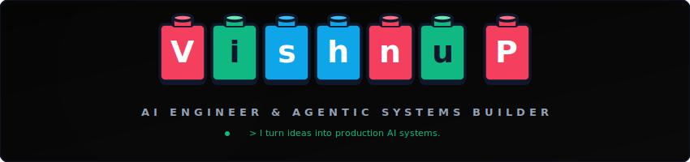
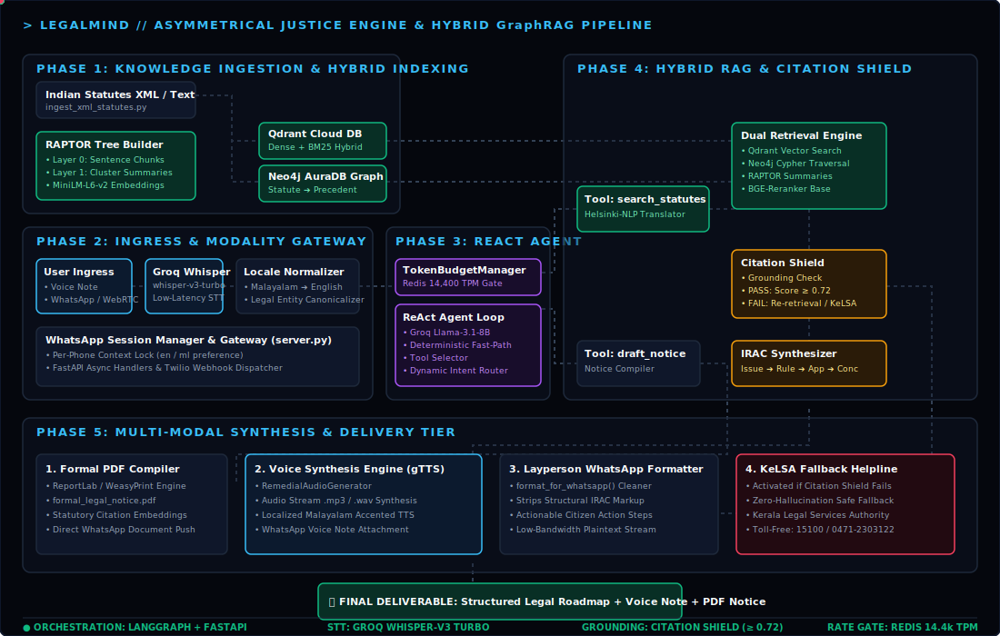
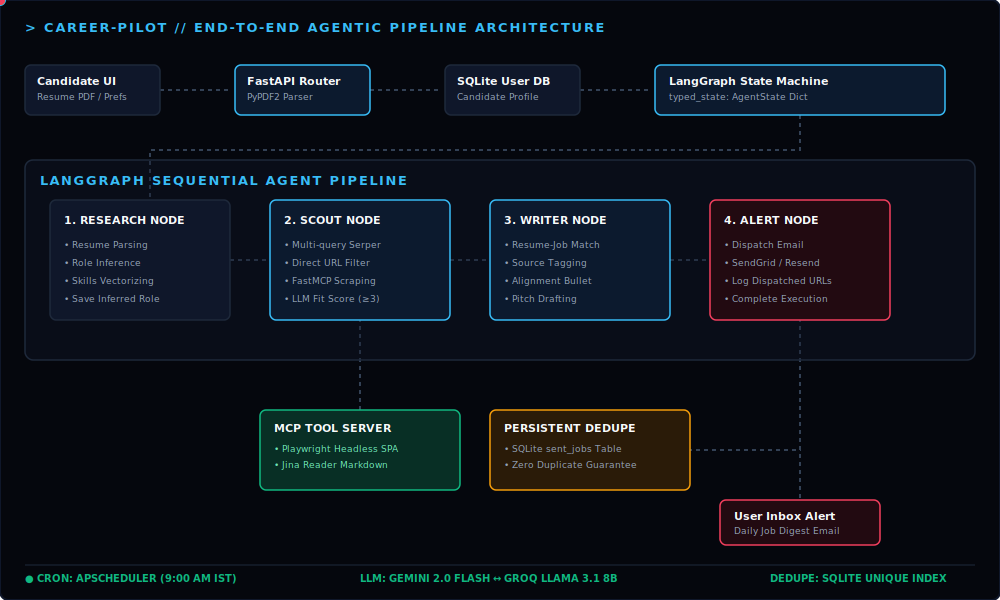
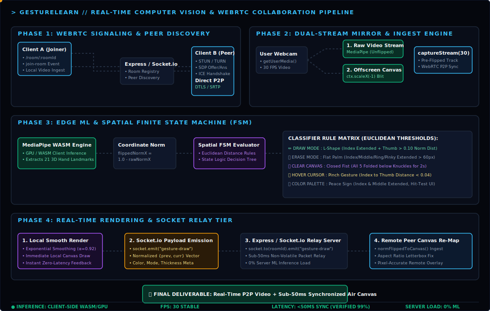

 

---

## 🔨 Currently Building

**LegalMind** — WhatsApp legal advisory bot | LangGraph + Neo4j + Qdrant
> Core orchestration working. Debugging Twilio voice pipeline latency.

---

> [!IMPORTANT]
> ### 📐 Engineering Manifesto — Instructions Included
>
> **Design for Failure:** I treat production as inherently unstable. Across all my systems, I build in modular fallbacks — whether it's multi-tier scraping for agents or offline telemetry caching for WhatsApp bots.
>
> **State-Aware Execution:** I prioritize data integrity. From maintaining session states in WhatsApp bots to tracking long-horizon search tasks, I implement checkpointing so systems recover from interruptions.
>
> **Objective Validation:** I favor quantifiable metrics over manual testing. Whether it's an LLM-as-a-Judge scoring an agent's reasoning, or unit tests validating geometric algorithms in vision pipelines.
>
> **Always Ship:** My ultimate metric is deployment. I prioritize getting a functional build into the user's hands over endless polishing — every system is designed to be "shippable" from day one.

---

## 🧰 Brick Inventory (Tech Stack)

**AI & Core Domains**

**Languages & Frameworks**

**Infrastructure**

---

## 🧱 Featured MOCs (My Own Creations)

### ⚖️ [LegalMind](https://github.com/vishnup102002/LegalMind) `🚧 In Progress`
* **Core Idea:** An Asymmetrical Justice Engine that translates colloquial regional voice notes into structured legal roadmaps with a token-level Citation Shield.
* **Stack:** `LangGraph` • `Neo4j` • `Qdrant` • `Twilio API` • `Groq`
* **Status:** Core LangGraph orchestration and hybrid retrieval (Neo4j + Qdrant) are functional. Currently debugging voice-to-voice Twilio pipeline.

### ✈️ [Career-Pilot](https://github.com/vishnup102002/Career-Pilot) — Autonomous Job-Hunting Agent
* **Core Idea:** Stateful multi-agent system executing local semantic resume parsing, job matching, and automated applications via background scheduling.
* **Stack:** `Python` • `LangGraph` • `FastAPI` • `MCP` • `Docker`
* **Features:** 4-agent pipeline scoring job listings, FastMCP + Playwright server scraping, SendGrid notifications, and SQLite deduplication.
* **Read More:** [Technical Architecture Teardown](https://gist.github.com/vishnup102002/a53a2aa0a17ce1d4d26f6e94c8adc3ca) • [Live Space Demo](https://huggingface.co/spaces/Vishnuporkulath/career-pilot)

### 🎨 [GestureLearn](https://github.com/vishnup102002/gesturelearn) — Collaborative Real-Time Drawing Workspace
* **Core Idea:** Interactive room workspace with WebRTC media streaming and low-latency Socket.io signaling. Recognizes 21 hand landmarks (via MediaPipe) for real-time air-gesture canvas sketching.
* **Stack:** `React` • `WebRTC` • `Socket.io` • `MediaPipe` • `Node.js` • `WebAssembly`
* **Read More:** [Live Demo](https://gesturelearn.vercel.app)

### 🌊 [Kadal Aayus](https://github.com/vishnup102002/kadal_aayus) — Offline-First Sea Safety App
* **Core Idea:** Cross-platform sea safety application with Firebase telemetry streaming, Mapbox tracking, 6-day weather matrix caching, and localized Malayalam TTS for offline voice safety alerts.
* **Stack:** `Flutter` • `Firebase` • `Mapbox API` • `Local TTS Engines`

---

## 🔨 Experience Breakdown

#### 👾 Independent Builder | *Personal Projects (May 2026 — Present)*
* **Built** Career-Pilot — autonomous 4-agent job-hunting system using LangGraph, FastMCP, and Docker.
* **Building** LegalMind — WhatsApp legal advisory bot using GraphRAG (Neo4j + Qdrant) and Twilio.
* **Containerised** both projects with Docker for production deployment on HuggingFace Spaces.

#### ⚡ R&D Intern — AI/Agentic Systems | *Bluecast Technologies (Jan 2026 — Apr 2026)*
* **Engineered** a DXF-to-JSON parser using `ReAct` reasoning loops to automate room classifications for indoor navigation.
* **Created** custom geometric heuristics to extract spatial door-connectivity graphs, slashing API costs by **75%**.
* **Developed** a schema validation layer producing clean navigation-ready JSON outputs without post-processing.

#### 🎓 MCA Student | *TKM College of Engineering (Jul 2024 — Jan 2026)*
* **Optimized** core Data Structures & Algorithms (DSA) systems in Java for low-complexity execution.
* **Architected** real-time browser-based WebRTC signaling workspaces integrated with MediaPipe hand-tracking models.
* **Engineered** offline-first sea-safety telemetry caches and localized Malayalam TTS audio alerts for maritime safety.

---

## 📜 Certifications

* **AWS Generative AI and AI Agents Professional** — *Coursera, 2026*
* **IBM Generative AI & AI Agents Specialist** — *Coursera, 2026*
* **IBM Fundamentals of AI Agents Using RAG & LangChain** — *Coursera, 2026*
* **IBM Python for Data Science & Development** — *Coursera, 2026*
* **Data Structures and Algorithms** — *NPTEL, IIT Kanpur, 2025*
* **Python – Web Development Expert** — *NACTET, 2024*

---

## 📈 Real-Time Monthly Activity

  

  

  

---

## 📬 Let's Connect!

* 📧 Email: **[vishnup22102002@gmail.com](mailto:vishnup22102002@gmail.com)**
* 💼 LinkedIn: **[linkedin.com/in/vishnup22102002](https://www.linkedin.com/in/vishnup22102002/)**
* 🌐 Portfolio Website: **[vishnup.vercel.app](https://vishnup.vercel.app)**
* 📄 Resume: **[Resume PDF (Download)](https://vishnup.vercel.app/assets/VISHNU.pdf)**
* 🤗 HuggingFace Space: **[Vishnuporkulath](https://huggingface.co/Vishnuporkulath)**

Assembled brick by brick · Vishnu P © 2026

